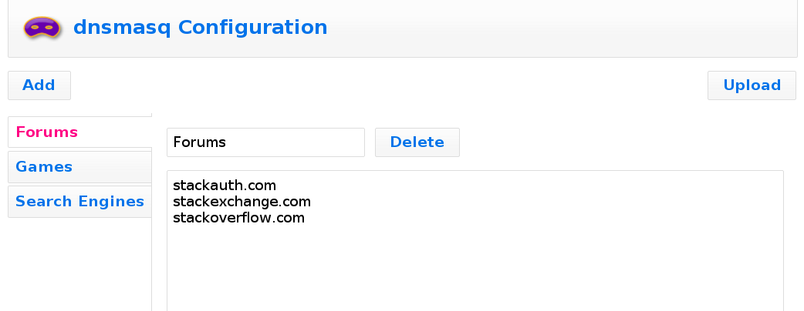

This application was designed to make it easy for non-technical users to manage
a whitelist of domain names for [dnsmasq][1]. With the advent of DNS over
HTTPS, it's now trivial for clients to bypass the DNS servers advertised by
DHCP. This is great for user privacy, but many parents will have mixed feelings.

If anyone knows of a good way to restrict DoH to a specific DNS server,
[please get in touch][2].

### Step 0: Prerequisites

While it may be possible to run this all on one host, it was designed to be run
on two: one as the DNS server and the other as the web server.

In addition to dnsmasq, the DNS server also needs iptables and an SSH server
installed. If you're using [DD-WRT][3] or [OpenWrt][4], it should already have
these. Otherwise, check your package manager.

The web server needs support for PHP, an SSH client with SCP, and TCL with the
Expect extension. These are normally installed through a package manager. On
Windows, use [Cygwin][5].

### Step 1: Download

Clone this repository to the web server:

```sh
$ git clone https://github.com/dave-kennedy/whitelist
```

### Step 2: Configure

Edit the following lines in dnsmasq.php to match your environment:

```php
$settings = array(
    // Locations of binaries on web server
    "expectPath" => "/usr/bin/expect",
    "scpPath" => "/usr/bin/scp",
    "sshPath" => "/usr/bin/ssh",

    // URL where we can download dnsmasq config file from DNS server
    "downloadUrl" => "http://192.168.1.1/dnsmasq.conf",

    // IP address of DNS server
    "dnsServer" => "192.168.1.1",

    // Location of DNS service file on DNS server
    "dnsService" => "/etc/init.d/dnsmasq",

    // Name of user with admin rights on DNS server
    "sshUser" => "root",

    // Location where we will upload dnsmasq config file to DNS server
    "uploadPath" => "/etc/dnsmasq.conf",

    // IP address to forward DNS requests that pass whitelist
    "upstreamDns" => "8.8.8.8"
);
```

The dnsmasq config file needs to be available for the application to download as
indicated by the `downloadUrl` setting. If you're using OpenWrt, you can create
a symlink to this file in the web root:

```sh
# ln -s /etc/dnsmasq.conf /www/dnsmasq.conf
```

If your DNS server does not also have a web server installed, `downloadUrl` can
point to the location of a local copy of the config file instead - in theory.

If there is no config file, the application will create an example that looks
like this:

```
#[Options]
bogus-priv
domain-needed
no-resolv

#[Category: Forums]
server=/stackauth.com/8.8.8.8
server=/stackexchange.com/8.8.8.8
server=/stackoverflow.com/8.8.8.8

#[Category: Games]
server=/steampowered.com/8.8.8.8
server=/teamfortress.com/8.8.8.8 #This is a comment
server=/valvesoftware.com/8.8.8.8

#Games are awesome
server=/gog.com/8.8.8.8

#[Category: Search Engines]
server=/bing.com/8.8.8.8
server=/duckduckgo.com/8.8.8.8
server=/google.com/8.8.8.8
```

Most important are the first three options: `bogus-priv`, `domain-needed` and
`no-resolv`. If there was already a dnsmasq config file in place, make sure it
contains these.

Finally, add these firewall rules on the DNS server to prevent users from
bypassing the whitelist:

```
iptables -t nat -I PREROUTING -p tcp --dport 53 -j REDIRECT --to-ports 53
iptables -t nat -I PREROUTING -p udp --dport 53 -j REDIRECT --to-ports 53
```

### Step 3: Test

Navigate to the URL where you cloned the repository in your web browser. It
should look something like this:



The interface is self-explanatory: you can add and delete categories using the
"Add" and "Delete" buttons, change categories using the tabs on the left side,
rename a category using the text input on the right side, and add domain names
to the textarea beneath the category name to allow them through the whitelist.

When you're finished editing, use the "Upload" button to upload the
configuration to the DNS server. You will be prompted for the password of the
user specified by the `sshUser` setting above.

[1]: http://www.thekelleys.org.uk/dnsmasq/doc.html
[2]: https://github.com/dave-kennedy/whitelist/issues
[3]: http://www.dd-wrt.com/
[4]: http://www.openwrt.org/
[5]: http://www.cygwin.com/
